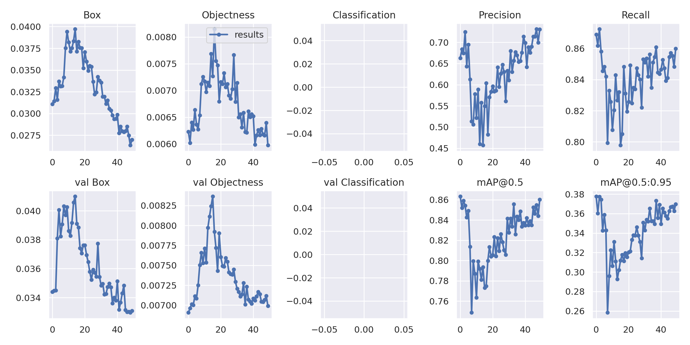

# YOLOv5 for VETII

This repository is a fork of the [Ultralytics YOLOv5 repository](https://github.com/ultralytics/yolov5), containing the same PyTorch-based model implementation with additional settings and configuration files for the VETII project. Some additional functionality is included that provides for centre point plotting during inference.

See the original repository for full documentation, including training a model from scratch.


## Requirements

Python 3.8 or later with all [requirements.txt](https://github.com/harryjmoss/yolov5/blob/main/requirements.txt) dependencies installed, including `torch>=1.7`. To install run:
```bash
$ pip install -r requirements.txt
```

## Recommended tutorials provided by the original repository

Roughly in order of importance

* [Train Custom Data](https://github.com/ultralytics/yolov5/wiki/Train-Custom-Data)&nbsp;
* [Weights & Biases Logging](https://github.com/ultralytics/yolov5/issues/1289)&nbsp;
* [Multi-GPU Training](https://github.com/ultralytics/yolov5/issues/475)
* [Test-Time Augmentation (TTA)](https://github.com/ultralytics/yolov5/issues/303)
* [Transfer Learning with Frozen Layers](https://github.com/ultralytics/yolov5/issues/1314)&nbsp;

## Pretrained Checkpoints
Two trained checkpoints are available. Both sets of weights are based on a yolov5x model (pre-trained on the COCO dataset (https://cocodataset.org/#home)) and are available via the [Ultralytics repository]((https://github.com/ultralytics/), which achieved the highest listed performance by the mAP[0.5:0.95] metric.

Starting from the pretrained model, the following steps were taken to produce both sets of weights described in the table below:

0) Data preparation is carried out for the [MASATI-v2 dataset](https://www.iuii.ua.es/datasets/masati/) and Sassoon dock dataset as described in the [vetii project repository](https://github.com/UCL-RITS/vetii).
1) Transfer learning is used to further train the model for 100 epochs on the single-class subset of the [https://www.iuii.ua.es/datasets/masati/](MASATI-v2) dataset produced in step 0, using the default settings provided by the YOLOv5 repository.
2) Additional training is then performed on the Sassoon dock dataset, using the weights produced from step 1. as a starting point for training. The weight sets shown below were trained on the Sassoon dock dataset for 150 and 100 epochs, respectively, with the number of epochs shown in the weight file name.

Metrics are calculated with respect to the Sassoon dock dataset. Models listed can be found in the `weights` directory.

| Model .pt file | Precision| Recall | mAP[0.5] | mAP[0.5:0.95]
|---------- |------ |------ |------ | -------- | ------| ------ |------  |  :------: |
| sassoon_wandb_best_150epoch_trained_on_masati100epoch_yolov5x | 0.523 | 0.958 | 0.923 | 0.550
| sassoon100epoch_best_trained_on_masati_yolov5x_100epoch.pt | 0.532 | 0.948 | 0.921 | 0.562

## Training a yolov5[smlx] model - requires GPU!

* Prepare the MASATI-v2 and Sassoon dock datasets as described in the [VETII project repository](https://github.com/UCL-RITS/vetii/)
* **Recommended step** - set up [Weights & Biases](https://wandb.ai/) to monitor the effect of hyperparameter evolution on key metrics such as train/validation loss, mAP, precision, recall.
* Train the model with the following command. Training times for YOLOv5x (largest model) were around 8 hours on the MASATI-v2 dataset with a single V100 and a batch size of 16. Multi GPU setups will be faster.

```
$ python train.py --img 512 --batch 16 --epochs 50 --data masati.yaml --weights weights/masati_yolov5x_50epoch_training.pt --workers 0
```
Setting `--workers 0` was necessary on the cloud platform used to train on the MASATI-v2 and Sassoon Dock datasets, but may not be necessary for all users. 

Results of the `N`th training are output in the `runs/train/expN` directory.



* Further train the model on the Sassoon Dock dataset
 ```bash
 $ python train.py --img 1175 --rect --batch 2 --epochs 100 --data sassoon.yaml --weights weights/masati_yolov5x_100epoch_best.pt --workers 0
 ```
* You will have now recovered (or be close to) the `sassoon100epoch_best_trained_on_masati_yolov5x_100epoch.pt` results. To recover the 150 epoch results, move the output weights of the above command into the `$YOLOv5Dir/weights/` directory before running the following command:
```bash
$ python train.py --img 1175 --rect --batch 8 --epochs 50 --hyp data/hyp.sassoon.yaml --data sassoon.yaml --weights weights/sassoon100epoch_best_trained_on_masati_yolov5x_100epoch.pt --workers 0
```

## Inference

`detect.py` runs inference on a variety of sources, including images, video, directories, glob and live streams. For input sources other than images, please see the [original YOLOv5 documentation](https://github.com/ultralytics/yolov5#inference).

To run inference on example images in `$YOLOv5Dir/data/images/sassoon` (*where* `$YOLOv5Dir` *is the directory containing this repository*!):
```bash
$ python detect.py --source $YOLOdata/images/sassoon --weights sassoon_wandb_best_150epoch_trained_on_masati100epoch_yolov5x --conf 0.25
```

### Things to try
* Test Time Augmentation ([TTA](https://github.com/ultralytics/yolov5/issues/303)) runs at 3 image sizes. **Reproduce TTA** by `python test.py --data sassoon.yaml --img 1175 --iou 0.65 --augment` 


